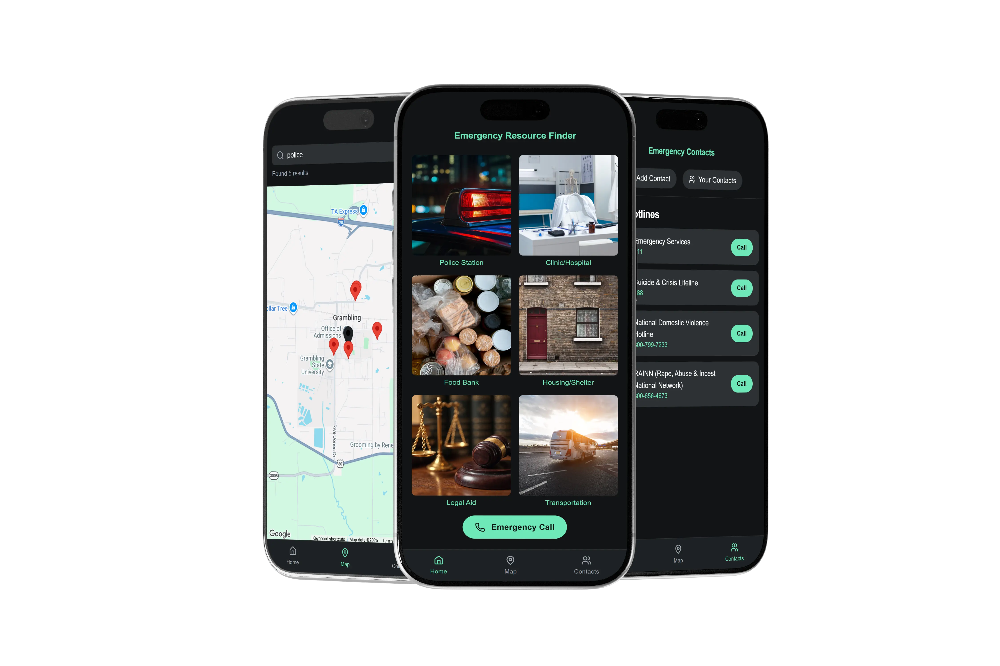

# AidPoint

Emergency resource finder for New Orleans. A React Progressive Web App that keeps working when the network doesn't.

<div align="center">

**[Live app](https://aidpoint-nola.vercel.app/)**&nbsp;&nbsp;&nbsp;&nbsp;&nbsp;&nbsp;&nbsp;&nbsp;**[Video walkthrough](https://youtu.be/Xt07w23A_9g)**



</div>

## Why

New Orleans is one of the most disaster-exposed cities in the country. I go to school in northern Louisiana, close enough to be exposed to the reality of just how bad things are. AidPoint gives fast access to verified emergency resources and keeps working without a network connection. When online, it searches Google Places for emergency resources near you. When offline, it serves a bundled, independently verified dataset specifically covering New Orleans.

## What it does

- Finds police stations, hospitals and clinics, food banks, shelters, legal aid, and transportation near you
- Queries Google Places within a 3,500m radius when online, falls back to bundled local data when offline
- One-tap dialing for 911, the 988 Suicide and Crisis Lifeline, the National Domestic Violence Hotline, and RAINN, plus your own saved contacts
- Installs to the home screen on iOS, Android, and desktop, no app store

## Offline data

27 emergency resources across New Orleans and Orleans Parish, verified 2026-08-24.

Each entry was confirmed against an authoritative source (the organization's own site or a government page) plus two independent corroborating sources, with name, address, and phone each checked separately. Every record carries a `sourceUrl` pointing to its authoritative source and a `lastVerified` date.

Shelters are marked year-round or event-activated. All five currently listed are year-round, though one is a best-available inference rather than an explicit statement from the organization. Operating status changes. Reconfirm before relying on this in an active emergency.

## Stack

React 19 · Create React App · Tailwind CSS · Google Maps and Places APIs · `@react-google-maps/api` · lucide-react

No external state management library. React's own hooks covered the need at this scale.

## Run it locally

```bash
git clone https://github.com/ShalomDee/aidpoint.git
cd aidpoint
npm install
echo "REACT_APP_GOOGLE_MAPS_API_KEY=your_key_here" > .env
npm start
```

Requires a Google Maps API key with the Maps JavaScript API and Places API enabled. Note that Create React App inlines environment variables at build time, so the key is visible in any deployed bundle. HTTP referrer restrictions in Google Cloud Console are the actual control.

## Design notes

Built for one hand, one phone, low battery, and a user who can't be asked for precision.

- **Dark theme.** In an emergency, remaining battery is a resource.
- **High-contrast emerald accents.** Critical actions stay legible under glare.
- **Portrait-locked, standalone display.** The use case is standing somewhere, holding a phone.
- **Bottom tab navigation.** Thumb-reachable, no learning cost at a moment with no capacity to learn.
- **Near-zero-input dialing.** Emergency calling is the shortest path in the app.

Geolocation uses `watchPosition` with explicit handling for permission denial, unavailable position, and timeout, each producing a distinct message, plus a coordinate fallback so the map always renders a usable view. A custom `useLocalStorage` hook handles storage failure rather than assuming `localStorage` is writable, and `useDebounced` limits Places API calls during typing.

## Known limitations

- Resource data covers Orleans Parish only
- Hotlines are US-specific
- Live search depends on Places API quota
- One shelter's year-round status is inferred, not stated by the organization

## Built for

Final project for CS50x, Harvard University's Introduction to Computer Science. Sole author.
